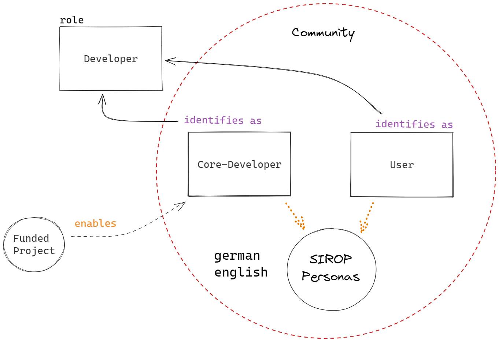
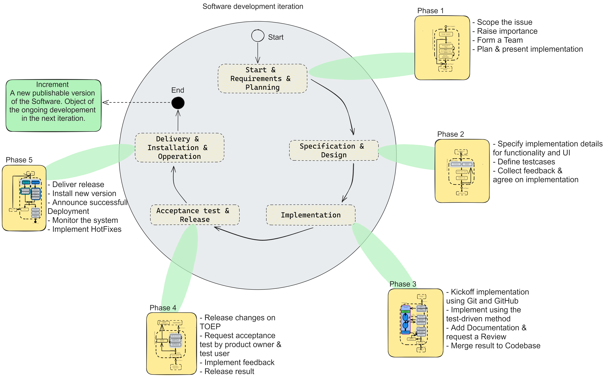
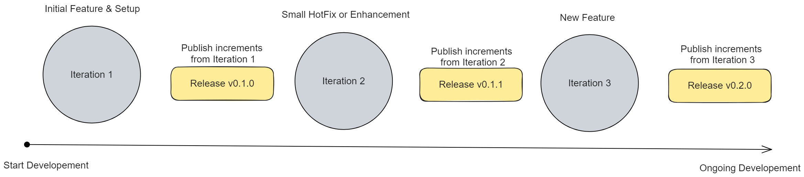
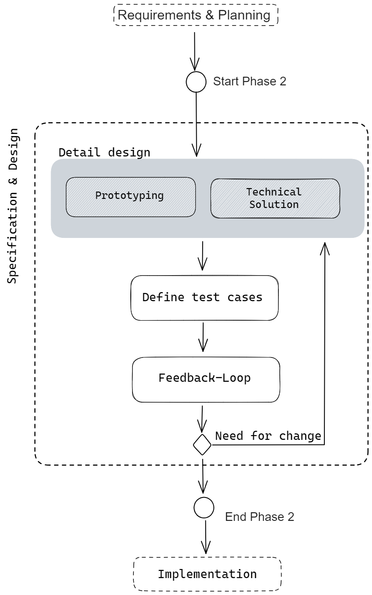
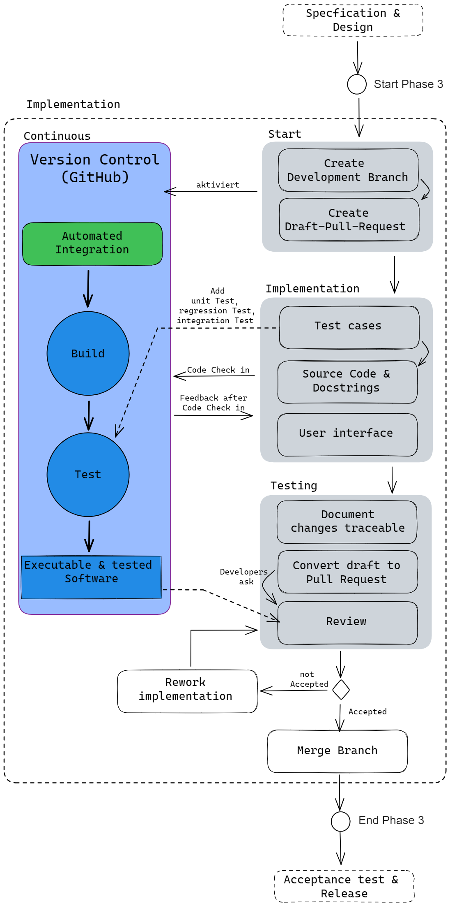
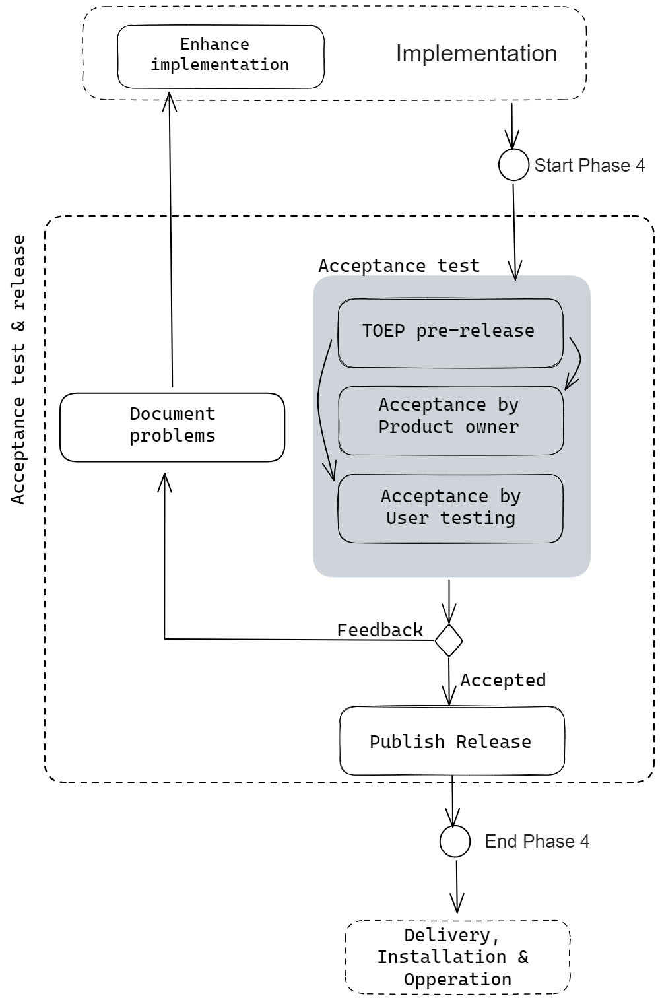
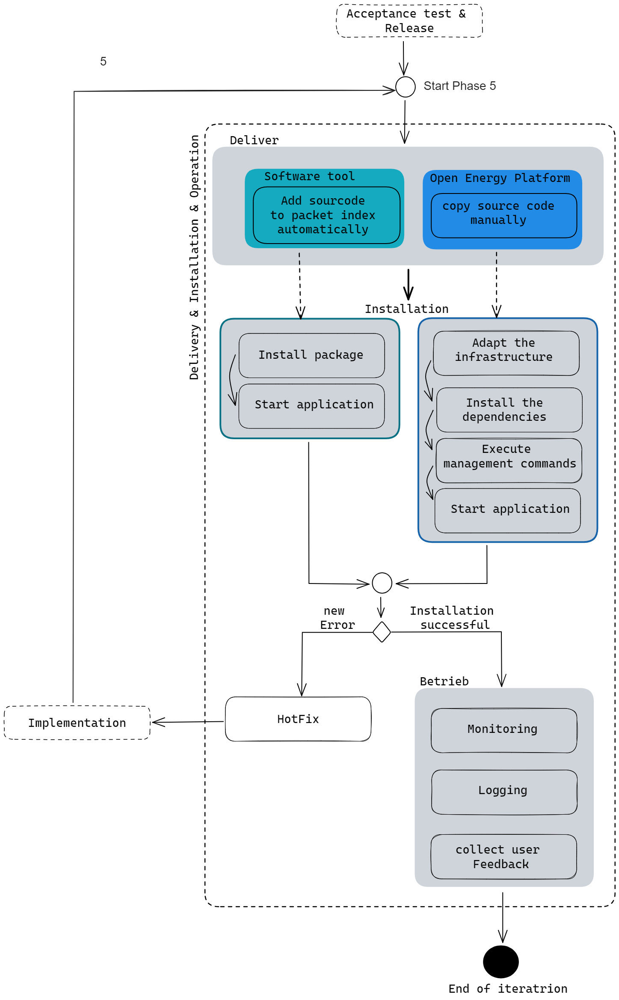

# Collaborative Development

__Our concept of collaborative development__

Researchers who participate in the development of the Open Energy Family are
known as "core developers". Their work involves capturing scientific processes
that can be implemented in software, gathering requirements, and developing
processes or artifacts such as software code and test results.
Additionally, they contribute to the development of specific Family Members,
like the ontology, drawing on their expertise in fields such as energy systems.
Core developers collaborate with the open community to improve and maintain the
software and troubleshoot any issues that arise.

To ensure the transparency and accessibility of the development process,
all developments are publicly planned, executed, and documented on GitHub and
in development meetings.
Core developers also have direct or indirect access to internal systems such as
servers that cannot be publicly accessible for security reasons.

While the core developers are responsible for the bulk of the development work,
the Open Energy Family is open to participation from anyone interested in
contributing.
This includes stakeholders such as other researchers in the energy system
domain who may not be directly involved in the research projects but have an
interest in the tools and services offered by the framework.

As the work of core developers requires significant effort, funding is crucial
to ensure their continued participation. It is therefore essential that
individuals are deployed as part of a research project that provides adequate
funding for their work. By embracing the collaborative spirit of Open Science,
the Open Energy Family is able to leverage the expertise and contributions of a
diverse range of stakeholders to create a more sustainable and
equitable energy system.

<figure markdown>
  { width="600" }
  <figcaption>
    The figure shows the structure of the community (purely in regard to development): The total community is divided into two groups, which were defined in detail as personas. As shown, both groups can participate in development, but the core developers take on a special responsibility here and usually work with the support of funded research projects.
  </figcaption>
</figure>

## Collaborative software development process

The following outlines how software development is implemented collaboratively in an open-source and research environment. The previously described concept of collaborative development sets the framework for software development here.

The essential components through which software development is carried out include a tailored iterative development process aligned with our requirements and a role concept. These components will be described in detail, but it should be noted that additional practices must be employed to implement development in practice. An example is development using Git and GitHub. For collaboration, we have created detailed guidelines for naming Git branches and templates for issue creation, which are linked to the appropriate locations.

### Develope Iterative & Incrementally

We adhere to the common iterative model for software development and the software lifecycle. In the Open Energy Family, we primarily focus on continuous development of our software, which is developed and further improved in various research projects. For this reason, we view development as a process that must enable organic growth. At the same time, we recognize the need to handle various types of requirements, including fixed and long-term requirements from research projects, as well as flexible and short-term requirements arising either from users or the identification of new requirements during development. Such an approach is described in the literature as a Hybrid Development Model, as we do not exclusively follow an agile approach and do not strictly adhere to the Waterfall model in project implementation.

Our iterative process is presented here as an overview and spans the various phases of the software lifecycle. The result is an increment that is to be understood as a specific version of the software. An increment can be released and serves as the starting point for the subsequent iteration. It is important to highlight the integrated documentation and testing steps. By incorporating these tasks as integral parts of development, we ensure complete documentation, goal-oriented development through acceptance testing, and the functionality of the software at all times.

<figure markdown>
  { width="600" }
  <figcaption>
   Overview of an iteration of the collaborative software development process of the OpenEnergyFamily. The circle shows the software life cycle, which has been adapted to the specific requirements. The yellow boxes give an impression of the process used for each phase. A summary of the process is then shown next to it.
  </figcaption>
</figure>

Over time, the increments are further developed, and an optimal solution is approached. The advantage lies in the fact that each increment is immediately available to all users as a release. This allows for feedback to be incorporated into each subsequent iteration, particularly to ensure user-friendliness.

<figure markdown>
  { width="800" }
  <figcaption>
    Ongoing development is carried out through several iterations with the aim of regularly publishing a new software version. This ensures that the development status and the publicly available software version are not too far apart.
  </figcaption>
</figure>

Going through the phases and the associated effort beyond writing code and releasing software has various advantages. In the short term, it ensures that work is done properly and in line with the agreed-upon requirements for craftsmanship and product. In the long term, it aims to keep the software continuously maintainable and enable further development and reusability. For research, this is a particular focus that contributes to sharing software as research results in a traceable manner and finding synergies.

Below we show all phases in detail. The detailed information is relevant to facilitate teamwork. The goal is to enable a transparent and predictable way of working. Even if the work is not done directly in a team, it is still important to follow the steps to document development decisions in a traceable manner. Working with GitHub as a development platform should be kept in mind. Many additional pieces of information can be documented there, and communication with others is greatly simplified. Communication in development teams and even at a higher level within the entire community or with individuals involved in development should ideally always be up to date. This way, the overall structure of the software architecture should always be known.

### Developement phases

In a nutshell, the collaborative software development process defines the approach from the vague idea through getting involved & start planning, testing & implementation to release and finally installation and operation. The aspect of collaborative cooperation is particularly emphasized here, as our software products are freely usable open source software. In the long term, we strive for community-driven implementation during development. In doing so, we are following the idea that the OpenEnergyFamily can be used as a framework for various research projects and thus expanded. The vision is to work together on the implementation of optimal solutions. The community benefits from the freely usable results & infrastructure, the available expertise and the opportunity to contribute its own ideas and thus actively participate in shaping them. We want to follow the Open Science principles.

#### Phase 1: Start, Requirements & Planning

<figure markdown>
  { width="300" }
</figure>

Change Request

Decision Gate

- hotfix
- feature

Prioritize & Plan

Form development team (1-n developer)

Specify requirements

#### Phase 2: Specification & Design (User interface & Software functionality)

<figure markdown>
  { width="300" }
</figure>

#### Phase 3: Implementation

<figure markdown>
  { width="400" }
</figure>

#### Phase 4: Acceptance test & release

<figure markdown>
  { width="300" }
</figure>

#### Phase 5: Delivery, Installation & Operation

<figure markdown>
  { width="400" }
</figure>

## GitHub Teams

We have specific _Softwaredeveloper Roles_ which are implemented as [_GitHub Teams_](https://github.com/orgs/OpenEnergyPlatform/teams/oef-software-developer/teams)
to coordinate the development. 
They can only be seen by members of the community.

Below, we present a comprehensive overview of all teams dedicated to the developement of software and provide clarification on the identified responsibilities for each role.

In addition to clarifying the responsibilities, we leverage teams to enhance communication. This is particularly effective on GitHub, where users can mention teams in issues, discussions, or pull requests to reach a group of individuals and increase the likelihood of receiving prompt responses. To contact a specific team, use "@" followed by the team name.

To apply for contribution, please get in touch. Take a look at our [contact information](contact.md).

| Team                      | Responsibilities                                                                                                          | [GitHub Rights](https://docs.github.com/en/organizations/managing-user-access-to-your-organizations-repositories/repository-roles-for-an-organization#permissions-for-each-role) |
|---------------------------|---------------------------------------------------------------------------------------------------------------------------|---------------|
| oep-domain-expert-energy-modelling | - Answers domain-specific questions - Ensures that functionalities solve or support domain-specific problems           | Read          |
| oep-community-manager     | - Moderates issues and discussions - Enforces the "Code of Conduct" and "Contributing" guidelines - Maintains the guidelines       | Triage        |
| oep-product-releaser      | - Enforces release guidelines - Publishes GitHub release - Ensures a release is delivered - Maintains the documentation of changes and the release procedure | Maintainer    |
| oep-product-owner         | - Knows the vision and mission of the overall project - Knows the product - Accepts or rejects changes              | Admin         |
| oep-ui-ux-developer       | - Ensures usability and user experience aspects are implemented - Assists in creating mockups or general design tasks such as graphics, logos, icons, etc. | Write         |
| oep-software-engineer     | - Can independently carry out development according to guidelines - Participates in the planning of ongoing development - Mentors junior developers and provides general technical support - Knows the architecture of at least one software product in the Open Energy Family - Conducts code reviews | Write         |
| oep-junior-developer      | - Has little or no experience in software development and the Open Energy Family - Wishes to contribute to development in the short or long term - Has basic programming knowledge | Write         |
| oep-expert                | - Knows the entire system: all products, especially the software products of the Open Energy Family, including the current architecture and usage, as well as planned developments - Understands dependencies and can assess the impact of changes - Has the final say in development decisions, such as which technology to use, which standards to follow, which pattern to implement | Maintainer    |
| oep-infrastructure-manager | - Implements and operates the CI/CD pipeline and assists in troubleshooting and log analysis - Installs new software versions on a server (after a GitHub release) - Installs new test software version on a server (before a GitHub release) - Manages the installation and operation of all other software tools such as documentation tools | Admin         |
| oep-tester                | - Tests the software, for example, once a test release is published - Continuously checks the functionality of the software products - Continuously checks the content, such as texts in training courses or texts on websites, etc. | Read          |
