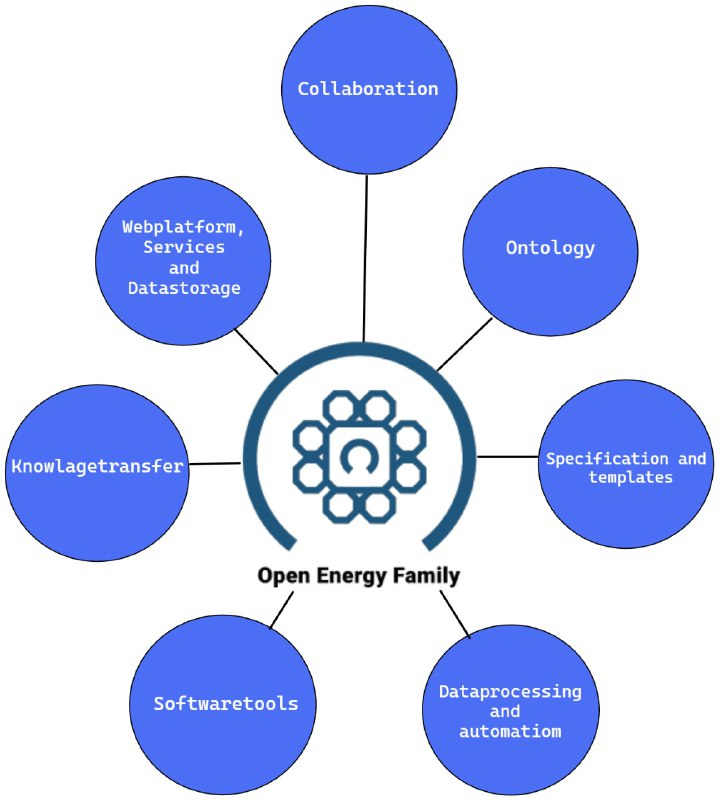
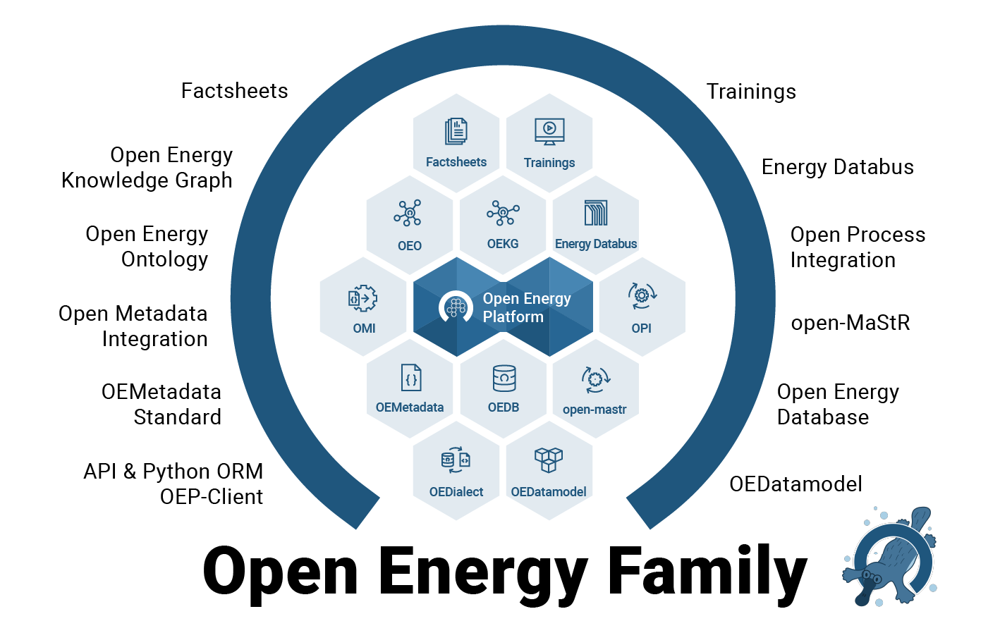

# The Open Energy Family Members

The Open Energy Family is an open science framework that aims to support the transition to a more sustainable and renewable energy system. The family focuses on creating and promoting open-source technologies, publicly accessible data, and transparent methods for energy system modeling. It is designed to facilitate collaborative research on solutions for research data management and modeling in the field of energy systems.

The project has already achieved considerable research success and is continuously being developed in state-funded research projects. The framework prioritizes openness, transparency, and accessibility to support the collaborative development of the framework.

<figure markdown>
  { width="400" }
  <figcaption>Image caption</figcaption>
</figure>

**Web Platform, Service, and Data Storage**
This area encompasses the Open Energy Platform as a web platform or website, which offers various services and integrates the Open Energy Database and Open Energy Ontology.

**Organization and Collaboration**
Organizational tasks for collaborative development work, community management, and conducting research projects are part of the work for the Open Energy Family. This work also includes organizing meetings to exchange content and development work.

**Ontology**
Developing the Open Energy Ontology and the Open Energy Knowledge Graph and creating solutions for displaying the knowledge graph in the Open Energy Platform are current tasks in this area. There is a particular focus on using the ontology to enable comparisons between scenarios of energy system modeling.

**Specification and Templates**
Maintaining the specification for extensive metadata, the Open Energy Metadata, for comprehensive documentation of energy system modeling data, and enabling linked data fall into this area. Additionally, standardized templates are available and continuously adapted. These templates include the Open Energy Data Model, which can be used for a harmonized data structure of tabular data from energy system modeling. Furthermore, factsheets are created, which allow for a standardized collection of parameters that describe frameworks, models, and scenarios of energy system modeling. Both templates are used to harmonize data, processes, and methods of energy system modeling and enable comparisons. The factsheets are directly integrated into the Open Energy Platform.

**Data Processing and Process Automation**
Creating routines for data processing is often an important step, e.g., to upload data to the Open Energy Database. The concrete implementation of these processes often involves very different requirements. An automated process provides a benefit for many users, and this area is accordingly part of the Open Energy Family to support the development and integration of such processes and to make the results reusable.

**Software Tools**
The Open Energy Family develops various software tools that are specifically designed for handling Open Energy Metadata or accessing the Open Energy Platform and Open Energy Database. The software tools require installation and are used as a local application. In general, these and future tools are intended to support all tasks of the Open Energy Family. An application case is, for example, the integration of the functionalities and services of the Open Energy Platform into the software of an energy system model to support data management.

**Knowledge Transfer**
The diverse possibilities of using the Open Energy Platform or working with the various software tools, specifications, and templates often require background knowledge. The area of knowledge transfer includes developing small tutorials for individual functions and creating courses that provide overarching content. Additionally, frequently asked questions are documented. All information is bundled and presented on the Academy website. This ensures that users have a central point of contact for learning the necessary background knowledge for successful handling of the Open Energy Family.

## Family members

As a framework, the Open Energy Family is continuously growing and has become quite substantial in content. The framework has a heterogeneous set of members, some of which are well-known and prominent, while others are smaller and less noticeable. Some members have their own repositories, while others are directly attached to other members. Together, they form a strong circle for working with open data and open science.

<figure markdown>
  { width="600" }
  <figcaption>Image caption</figcaption>
</figure>

## Access the live framework

The Open Energy Platform plays a special role in the framework as the web platform serves as the main interface for users. The Open Energy Platform provides various services (REST API) and functions for users, which are freely accessible over the internet. This allows users to programmatically integrate the interfaces into their applications or models, for example, to upload data automatically. The user-friendly and continuously evolving interface of the Open Energy Platform also simplifies data management for transparent energy system data. Most of the tools of the framework are available to users without the need for them to install them themselves. The software tools can also be installed locally, providing users with different ways to access the Open Energy Platform and the Open Energy Family

<figure markdown>
  { width="700" }
  <figcaption>Image caption</figcaption>
</figure>