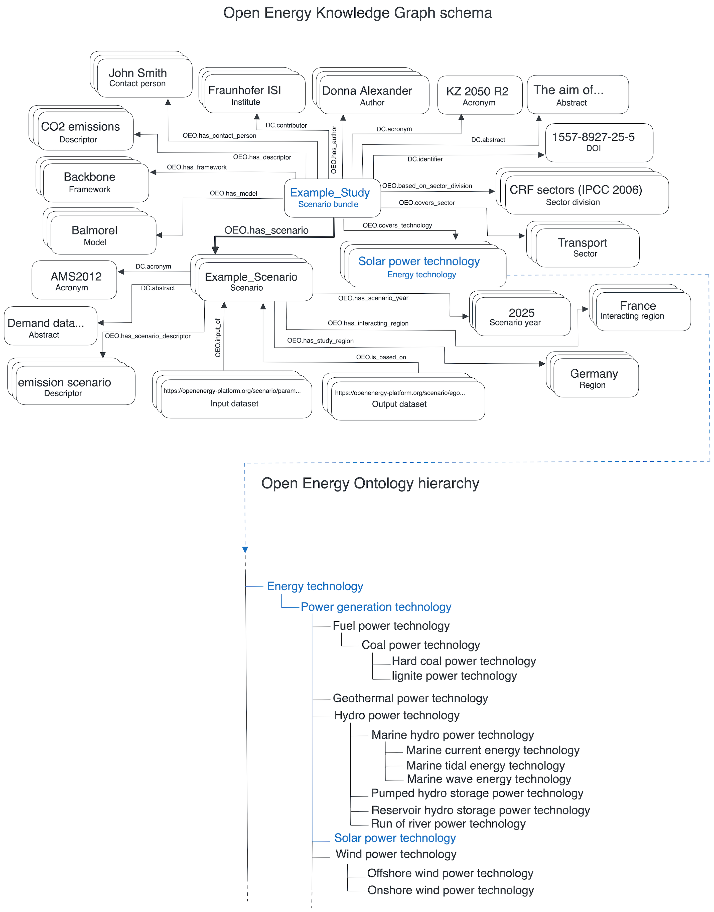

# Open Energy Knowledge Graph (OEKG)

The Open Energy Knowledge Graph (OEKG) is a network of entities, their semantic types, properties, and relationships for the energy system analysis domain. It is based on the RDF standard and uses the Turtle format.
Fundamentally, the development is according to the Open Energy Ontology (OEO).

The structure of the OEKG is based on graph of nodes and relations that are stored in a database. While the Open Energy Ontology offers a **comprehensive understanding** of the energy domain and a structured framework of interconnected concepts. Furthermore, the open energy knowledge graph has been carefully designed to effectively present **detailed information about specific instances** and also store these specific instances.

## Structure

The OEKG is used to store knowledge objects. The first major use case for this is scenario bundles on the OEP. The following graphic shows the structure of scenario bundles. A bundle is linked to all relevant knowledge objects. The arrows indicate which description is made and at the end of the arrow is what is mapped. The stacked fields represent the possibility of creating multiple instances. Studies and scenarios can be viewed independently of each other, but both are central elements for the application of the OEKG and can be linked to each other.

The tree view shows the connection to the OEO. When a field is created, classes from the OEO are instantiated and are available for selection by the user.

!!! Info
    The following  illustrates a generic model of the [scenario bundles](../templates-and-specification/scenario-bundles.md) which is the main instance available in the OEKG.

<figure markdown>
  
  <figcaption>The connection between Open Energy Ontology (OEO) and the Open Energy Knowledge Graph (OEKG)</figcaption>
</figure>
