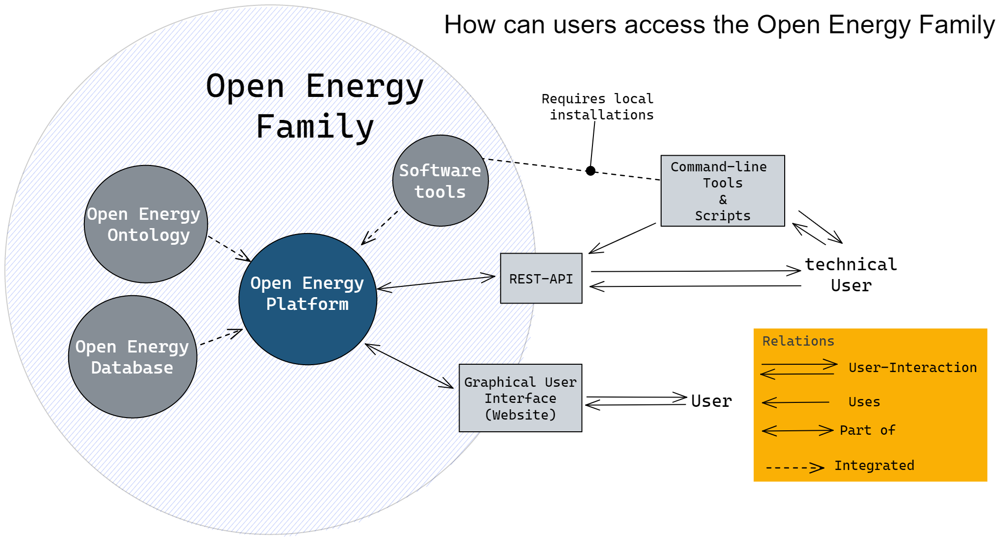

# Software Architecture

The software architecture of Open Energy Family is complex. We maintain several software systems and tools that form the framework, some of which are independent, most of which are interdependent or work closely together.

In this section we would like to give a general overview of the components of the architecture without getting bogged down in technical details. The details can be found in the respective repositories or documentation pages of the software systems and tools.

The Open Energy Platform plays a special role in the framework architecture as the web platform serves as the main interface for users. The Open Energy Platform provides various services, which are freely accessible over the internet. This allows users to programmatically integrate the interfaces into their applications, for example, to upload data automatically. Also most of the tools of the framework are available to users without the need for them to install them themselves. The software tools can also be installed locally, providing users with different ways to access the Open Energy Platform and the Open Energy Family. At the same time, there are some members of the framework who also offer their user interface as a website like the Databus. The Databus offers improved data findability by registering metadata that was previously created on the Open Energy Platform. This shows that the complex processes are carried out via different systems.

From a development perspective, this distribution of responsibilities is necessary to avoid adding too much complexity to individual systems. For users, this results in challenges that make it difficult to understand the system as a whole. An important task of the architecture is therefore to maintain this overview and to create user-friendly, standardized processes.

<figure markdown>
  { width="700" }
  <figcaption>The members of the Open Energy Family are largely integrated into the Open Energy Platform. For example, the databus that registers metadata from the OEP but does not work directly in the OEP is not included.</figcaption>
</figure>
