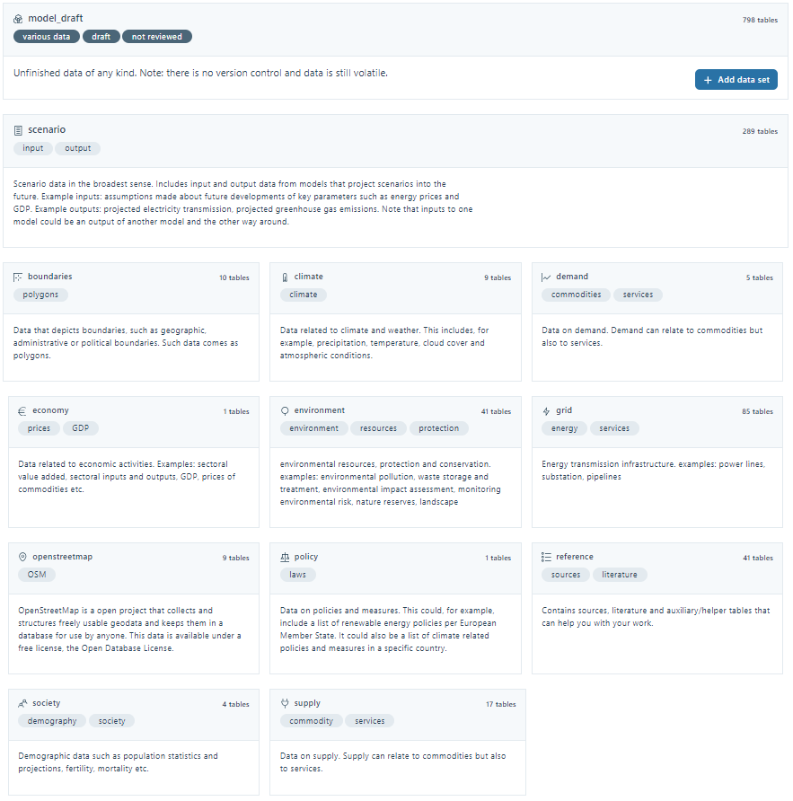

# Open Energy Database

The OpenEnergyDatabase (OEDB) is the primary database of the OpenEnergyPlatform (OEP). Users can upload and download data in the format of tabular data sets there bx using the OEP interfaces. It is also possible to view and search the contents of the data resources via a preview view on the OEP. In general, the OEDB is intended for the storage of data from energy system models, which is limited to the storage of input and output data used for certain scenarios. However, the need for data goes beyond the topic of energy scenarios, which is why it is also possible to store data on other topics. Overall, the OEDB thus aims to establish an open and jointly managed central database that makes all data relevant to the energy transition available and usable for everyone.

!!! info "Access the Open Energy Database"
    <https://openenergy-platform.org/dataedit/schemas>

<figure markdown>
  { width="800" }
  <figcaption>
    Topics are meticulously curated on the OEP-Website, where data is seamlessly sorted through interfaces. The initial upload takes place in the model_draft schema, ensuring precision before being published and seamlessly transitioned to the designated target topic.
  </figcaption>
</figure>
