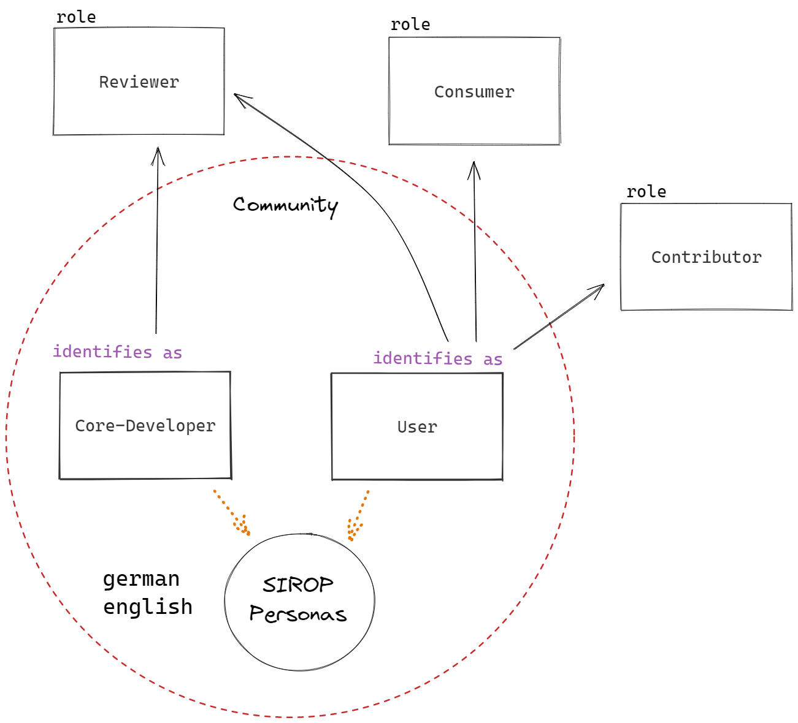
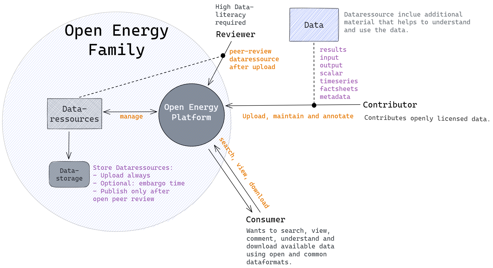

# Open Energy Platform

The Open Energy Platform is an open-source software that provides a shared research data infrastructure for the energy sector. It offers tools for data management, analysis, and visualization to support the transition to a sustainable energy system. The platform is flexible and modular, allowing it to be integrated with a variety of existing systems and data sources. The Open Energy Platform is intended to be used by researchers, policymakers, and other stakeholders in the energy sector to facilitate data-driven decision-making processes and promote transparency and collaboration. The data available in the platform can be used to support the planning and operation of energy systems, as well as promote the development of renewable energy sources and the implementation of energy efficiency measures.

!!! info "Access the Open Energy Platform"
    <https://openenergy-platform.org/>

## Overview of the Platform Application Components

Components of our Website-Project that we are actively developeing on [GitHub](https://github.com/OpenEnergyPlatform/oeplatform). 
Each component represents a [Django App](https://docs.djangoproject.com/en/4.2/ref/applications/) and includes a specific functionality or area of the Open Energy Platform Website.

| Component  | Function |
|------------|----------|
| oeplatform | - Configuration of the Django application - Security-critical configuration such as connection data to a database |
| base       | - Basic structure for homepage and views in other components - Mainly static content for textual description of OEP and research projects - Contact form - Legal information |
| api        | - Provision of the RESTful API - Data management - Generic and specific data queries using query parameters - User permission querying |
| login      | - User management - Login system |
| dataedit   | - Presentation of database contents - Metadata management and annotation of ontology terms - Data management via user interface - Tag system - Data visualization - Data querying via user interface - Open Peer Review for data |
| modelview  | - Creation and editing of various factsheets using a developed standard format in the form of a form - Factsheet searching - Tag system |
| ontology   | - Integration of the Open Energy Ontology - Presentation of the contents of OEO - Descriptive contents about OEO and the development process |
| oeo_viewer | - Open Energy Ontology visualization - Open Energy Ontology search functionality - Special feature: Integrated React application |

In addition to Django apps, there are other components that serve specific functionalities within the system:

| Component               | Explanation                                                                                                                                                                                                                  |
|-------------------------|----------------------------------------------------------------------------------------------------------------------------------------------------------------------------------------------------------------------------|
| theming                 | Configures the global design using Bootstrap5 and provides design components that are imported into the software components listed above. This is where the user-friendly and aesthetic presentation of the web application is configured.                                |
| oedb_datamodels         | Implements database migration schemas used for migrating changes to the database (OEDB). These schemas are utilized by an imported software tool to manage all changes to the Open Energy Database from within the Django application.                             |

## Users
The user concept allows us to define specific user groups who will interact with the Open Energy Platform in unique ways. Our goal is to facilitate effective data management, simplifying processes such as sharing, reproducing, versioning, and publishing in the energy system research domain. We have identified three distinct user roles.

In certain cases, the tasks that users need to perform may be complex and require a learning process. In such instances, it is essential for developers to contribute to these tasks until the community gains proficiency and expertise.

<figure markdown>
  { width="500" }
  <figcaption>Open Energy Family Community user roles</figcaption>
</figure>

## Use Cases

**Consumer**
The role of consumers is to access websites such as the Open Energy Platform and search for current data sets. It can be assumed that these are often researchers in the field of energy system modeling. Accordingly, functionalities must be offered to them to search, filter, and download data resources. Additionally, a consumer needs a view with detailed information about a data resource. The Open Energy Platform provides visualization tools, a dataset and metadata view, as well as various filtering functionalities that allow for text-based, tag (keyword), and data table-based searches.

**Contributor**
Publishing research results in the field of open science is important, but it places some requirements on the researchers. The motivation of a contributor is usually to publish research results and contribute to the transparency and reproducibility of research. To do this, a contributor needs a user-friendly process that allows for the database-compliant creation and uploading of tabular data resources. In addition, the process should integrate the creation of metadata in the Open Energy Metadata Format. Afterwards, a contributor needs to be certain whether the artifacts of data management, such as tabular data and metadata, were created correctly. Open Peer Review is used for this purpose. In a feedback loop, the suggestions of a reviewer are discussed and incorporated. The dataset is then published. Later, a contributor can update their dataset and go through the review process again.

**Reviewer**
The Open Peer Review of the Open Energy Family is integrated into the Open Energy Platform. After a contributor uploads a new data resource (research results as tabular data, metadata, and additional documents) for publication, this dataset is released for review. A user with an account on the Open Energy Platform can then start the review process and carry it out through an interactive web application. The review allows for several feedback loops between the contributor and reviewer, in which the metadata is checked in the form of the Open Energy Metadata Metadata Specification. The reviewer checks all data fields of the Open Energy Metadata and either agrees with the information, suggests changes, or rejects the information. In this way, a reviewer makes a significant contribution to data quality, particularly to technical correctness and reproducibility of open datasets. To assess quality, developed badges are awarded that transparently represent the level of quality.

<figure markdown>
  { width="700" }
  <figcaption>Image caption</figcaption>
</figure>

