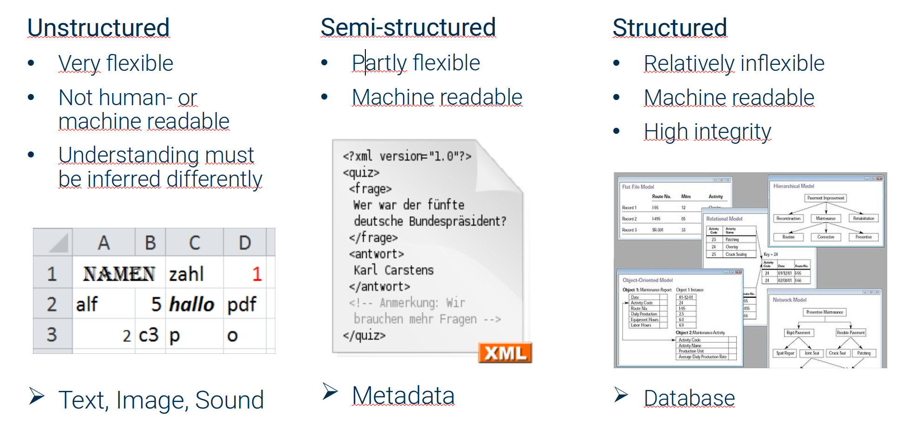
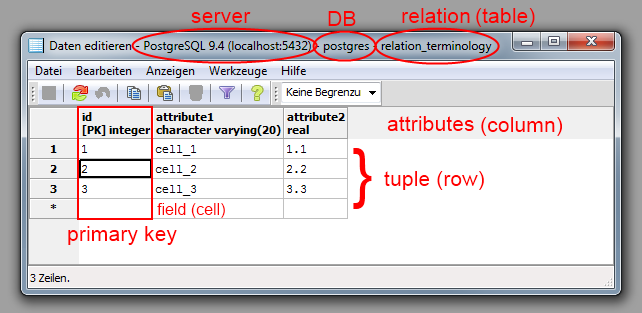

# Open Energy Metadata

!!! info "Access the Open Energy Metadata"
    <https://github.com/OpenEnergyPlatform/oemetadata>

# What is it and what is it good for?

Open Energy Metadata (OEMetadata) is a metadata standard designed specifically to be used on data for energy (systems) research. For Science, a metadata standard can provide unambiguity, transparency, objectivity, reliability, verifiability, openness, integrity and novelty. In short - it can help with [good scientific practice](https://www.dfg.de/foerderung/grundlagen_rahmenbedingungen/gwp/). OEMetadata adhere to the [FAIR](https://www.go-fair.org/fair-principles/) principles, i.e. they ensure Findability, Accessibility, Interoperability, and Reuse of digital assets.

# Structural Design

Data and metadata come in different levels of structuredness.

<figure markdown>

  { width="600" }
  <figcaption>Levels of structuredness</figcaption>
</figure>

OEMetadata are semi-structured and designed to accompany the data themselves. They can describe every structural element of tabular data

<figure markdown>

  { width="600" }
  <figcaption>Tabular Data</figcaption>
</figure>

When designing OEMetadata the following existing standards and agreements were considered:

- [Dublin Core](https://www.dublincore.org/specifications/dublin-core/) -> Documenting digital documents
- [Frictionless Data Package](https://specs.frictionlessdata.io/data-package/) -> A container format for in a single 'package'.
- [ISO_19115](https://www.iso.org/standard/53798.html) -> Geodata
- [INSPIRE](https://rdamsc.bath.ac.uk/msc/m66) -> Regulation on administrative and other specialized Geodata
- [DataCite](https://datacite.org/) -> Metadata Schema for data citations
- [schema.org](https://schema.org/) -> Schemas for structured data markup on web pages
- [PROV](https://www.w3.org/2001/sw/wiki/PROV) -> W3C specification providing a vocabulary to interchange provenance information
- [DCAT-AP](https://op.europa.eu/en/web/eu-vocabularies/dcat-ap) -> Application profile for data portals in Europe based on the Data Catalog Vocabulary

They shaped OEMetadata to varying degrees. Some of them were too general, others too specific. The following requirements lead us to define our own standard:

- Compatibility with csv and database tables
- machine- _and_ human readability
- Coverage of all aspects of metadata
- Coverage of all data and tailoring to energy system analysis
- Compliance with FAIR criteria
- Extensibility
- Well defined compatibility with ontology and linked open data
- Compatibility with DCAT-AP was originally planned, but the standard was found partly incompatible with datapackages
- Compatible with all: timeseries, geodata, parameter collections, data produced by machines, data collaboratively collected

Our concept to include ontology references is depiced in a poster ([pdf](../../pdf/2022-03-08_Poster_OEMetadata_OEO.pdf)) which was created during the development stage. The resulting standard is based on Data Packages. The file format is JSON (and JSON-LD). In it's simplest form a Tabular Data Package is a csv file containing data, accompanied by a JSON file which describes the name and structure of the data. OEMetadata take the standard set of keys and possible values and extend it with ones useful for energy research. It is inspired by Dublin Core, INSPIRE and DataCite. The
development process is organized on [GitHub](https://github.com/OpenEnergyPlatform/oemetadata) and open for everyone to see and
participate in. The repository contains the following useful files:

[metadata_key_description.md](https://github.com/OpenEnergyPlatform/oemetadata/blob/master/metadata/latest/metadata_key_description.md) - contains a description of each metadata key
[template.json](https://github.com/OpenEnergyPlatform/oemetadata/blob/develop/metadata/latest/template.json) - contains an empty metadata string
[example.json](https://github.com/OpenEnergyPlatform/oemetadata/blob/develop/metadata/latest/example.json) - contains a basic metadata example with filled fields
[schema.json](https://github.com/OpenEnergyPlatform/oemetadata/blob/develop/metadata/latest/schema.json) - JSON schema ensures a well defined standard

## Creation and management

- Creating a table on the OEP can be done through the [wizard](https://openenergy-platform.org/dataedit/wizard/). The menu has a section that helps you fill out OEMetadata to accompany your data
- To help with the creation of a standalone metadata file, the OEP has a [metadata creator](https://meta.rl-institut.de/meta_creator/) (You will need to be logged in to use it)
- There is a review process to maintain any given metadata on the OEP. This
  process was created to replace the now [deprecated process on GitHub](https://github.com/OpenEnergyPlatform/data-preprocessing/blob/master/data-review/manual/review_manual.md). As a owner of a table on the OEP, you can ask for a review which will start a guided review process. At the end of the process a badge will be assigned to the metadata depicting its level of completeness:
  - Iron – Technically required for data structure
  - Bronze – Basic description of the data
  - Silver – Supplement description of the data
  - Gold – Extended description of the context
  - Platinum – Ontological annotation

## Metadata keys with a description and example

The standard is under active development and currently available in version 1.6.0. The [table with a full key description](https://github.com/OpenEnergyPlatform/oemetadata/blob/master/metadata/latest/metadata_key_description.md) is shown here for convenience, but may not be as up to date as in the repository.
