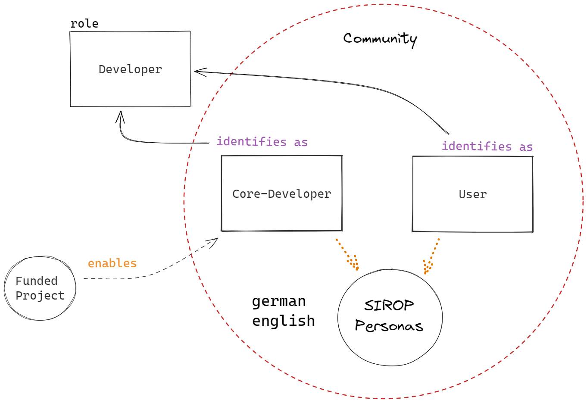

# Collaboration

The development of the Open Energy Family is mainly carried out in research projects by researchers from various research institutions. Accordingly, the development process continues through several research projects and is not bound to the duration of individual projects. An open development approach results in researchers and users (such as other researchers, interested individuals, or employees from companies) forming the Open Energy Family community. In practice, the groups of researchers and users often have strong overlaps. However, to clearly distinguish between who develops and who uses, and how users collaborate in the development, a subdivision is relevant.

## Concept of collaborative developement

Researchers who participate in a research project are referred to as "core developers". The methods and processes of development are transparent, with developments being publicly planned, executed, and documented on the GitHub platform and in development meetings.

Core developers in their research work capture processes that can be implemented in software to support scientific work. This involves gathering requirements and developing processes or artifacts such as software code and test results. Additionally, they contribute to the development of the ontology through their expertise in fields such as energy systems. They can also improve and troubleshoot the architecture of the Open Energy Family and understand the relationships between its various products. Moreover, they have direct or indirect access to internal systems such as servers that cannot be publicly accessible for security reasons. Core developers also collaborate with the open community to develop and maintain the software. Due to the effort involved, the work of core developers must be funded. Therefore, individuals should be deployed who are part of a research project that ensures their funding.

The development process embraces the collaborative spirit of Open Science, and users or anyone interested are invited to participate in the development. "Anyone interested" (or stakeholders) here refers, for example, to other researchers in the energy system domain who are not directly involved in the aforementioned research projects and have an interest in the tools or services of the Open Energy Family.

<figure markdown>
  { width="600" }
  <figcaption>Image caption</figcaption>
</figure>
